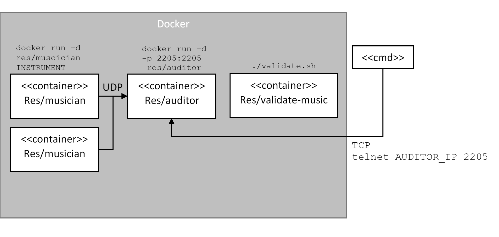

# Teaching-HEIGVD-RES-2020-Labo-Orchestra

## Objectives

RES laboratory about UDP
The lab objectives are:
* **Design and implement a simple application protocol over UDP**. A group of applications multicast events and a application listens to and processes them.
* Getting familiar with several tools from **the JavaScript ecosystem**. By implementing two simple **Node.js** applications. (One for the senders and one for the receiver.)
* Practice with **Docker**.

## Requirements

Each NodeJS applications is packaged in Docker images:
* The first app, **Musician**, simulates someone playing an instrument in an orchestra. 
When the app is launched, an instrument is assigned to it (piano, flute, etc.). 
Every second it will emit a sound (a string) through UDP communication protocol.
The sound depends on the instrument.
* The second app, **Auditor**, simulates someone listening to the orchestra.
This application has two responsibilities. First, it must listen to Musicians and keep track of **active** musicians.
A musician is active if he has played a sound during the last 5 seconds.
Second, it implements a very simple TCP-based protocol to indicate which musician is active.
* A third application exists to validate the fonctionning of the architecture via the **validate.sh** script.

### Instruments and sounds

The following table shows the mapping between instruments and sounds.

| Instrument | Sound         |
|------------|---------------|
| `piano`    | `ti-ta-ti`    |
| `trumpet`  | `pouet`       |
| `flute`    | `trulu`       |
| `violin`   | `gzi-gzi`     |
| `drum`     | `boum-boum`   |


### TCP-based protocol to be implemented by the Auditor application

* The auditor includes a TCP server and accepts connection requests on port 2205.
* After accepting a connection request, the auditor sends a JSON payload containing the list of <u>active</u> musicians, in the following format :

```
[
  {
  	"uuid" : "aa7d8cb3-a15f-4f06-a0eb-b8feb6244a60",
  	"instrument" : "piano",
  	"activeSince" : "2016-04-27T05:20:50.731Z"
  },
  {
  	"uuid" : "06dbcbeb-c4c8-49ed-ac2a-cd8716cbf2d3",
  	"instrument" : "flute",
  	"activeSince" : "2016-04-27T05:39:03.211Z"
  }
]
```


## Task 1: design the application architecture and protocols

| #  | Topic |
| --- | --- |
|Question | How can we represent the system in an **architecture diagram**, which gives information both about the Docker containers, the communication protocols and the commands? |
| |  |
|Question | Who is going to **send UDP datagrams** and **when**? |
| | The musician app every seconds. |
|Question | Who is going to **listen for UDP datagrams** and what should happen when a datagram is received? |
| | The auditor app and it lets it keep track of which musician is active. |
|Question | What **payload** should we put in the UDP datagrams? |
| | An unique UUID and The "sound" of the instrument. |
|Question | What **data structures** do we need in the UDP sender and receiver? When will we update these data structures? When will we query these data structures? |
| | An uuid, the sound (for the sender) or the name of the instrument (for the receiver) and the date at which the data was last send. The sender updates every second and the receiver gives the last active musicians for the last 5 seconds via the TCP connection. |


## Task 2: implement a "musician" Node.js application

| #  | Topic |
| ---  | --- |
|Question | In a JavaScript program, if we have an object, how can we **serialize it in JSON**? |
| | Using **JSON.stringify(object)**  |
|Question | What is **npm**?  |
| | **npm** is the package manager for the Node javaScript platform.  |
|Question | What is the `npm install` command and what is the purpose of the `--save` flag?  |
| | **npm install** adds a modules to use for a Node program. The **-- save** flag adds the module under **dependencies** in **package.json**. |
|Question | How can we use the `https://www.npmjs.com/` web site? |
| | **npmjs.com** allows you to explore and share community created packages. |
|Question | In JavaScript, how can we **generate a UUID** compliant with RFC4122? |
| | **UUIDs (Universally Unique IDentifier)** can be generated with the npm module **uuid** and it's already RFC4122 compliant.  |
|Question | In Node.js, how can we execute a function on a **periodic** basis? |
| | Using **setInterval(action, time_in_ms)**  |
|Question | In Node.js, how can we **emit UDP datagrams**? |
| | By using the npm package **dgram**. Call the **createSocket()** and **send()** method. |
|Question | In Node.js, how can we **access the command line arguments**? |
| | Using **process.argv[index]**. Or using the npm package **command-line-args** |


## Task 3: package the "musician" app in a Docker image

| #  | Topic |
| ---  | --- |
|Question | How do we **define and build our own Docker image**?|
| | By creating a dockerfile and using it to modify a base **node** image to add our program to run in it. |
|Question | How can we use the `ENTRYPOINT` statement in our Dockerfile?  |
| | The instruction **ENTRYPOINT** defines the command to be executed when the container is launched. It is used to run the application. |
|Question | After building our Docker image, how do we use it to **run containers**?  |
| | Using **docker run** command followed by the container name and a parameter for the name of the instrument to be played. |
|Question | How do we get the list of all **running containers**?  |
| | Using **docker ps** command. |
|Question | How do we **stop/kill** one running container?  |
| | Using **docker stop/kill** command with the name of the container to stop/kill. |
|Question | How can we check that our running containers are effectively sending UDP datagrams?  |
| | Using **windump** command (to install on Windows) or via wireshark. |


## Task 4: implement an "auditor" Node.js application

| #  | Topic |
| ---  | ---  |
|Question | With Node.js, how can we listen for UDP datagrams in a multicast group? |
| | By using **bind** method on the socket and passing the port to listen to. Not specifyng an address allows to listen to anyone. |
|Question | How can we use the `Map` built-in object introduced in ECMAScript 6 to implement a **dictionary**?  |
| | By associating each instrument with a sound, it is possible to identify what instrument is being played when receiving a sound. |
|Question | How can we use the `Moment.js` npm module to help us with **date manipulations** and formatting?  |
| | **Moment.js** to manipulate and display date format in javaScript. |
|Question | When and how do we **get rid of inactive players**?  |
| | When receiving a TCP request, if a sound was received more than 5 seconds ago and has not been repeated, then it's no longer active. |
|Question | How do I implement a **simple TCP server** in Node.js?  |
| | Using the **net** npm package. |


## Task 5: package the "auditor" app in a Docker image

| #  | Topic |
| ---  | --- |
|Question | How do we validate that the whole system works, once we have built our Docker image? |
| | By running **validate.sh** script. |
